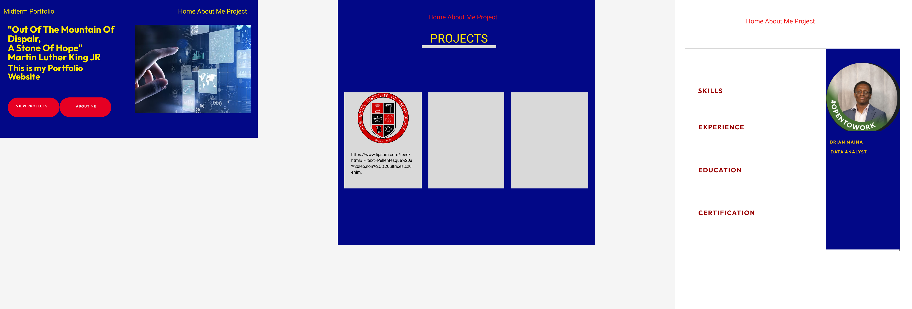

# Project Title: From Figma to Fully Responsive Portfolio Website 
## This project is forked from my previous GitHub Account
## During this Project: 
- Designed and refined visually appealing landing and project pages using Figma, creating detailed UI mockups to visualize layout, aesthetics, and user interactions
- Strategically employed User Acceptance Testing (UAT) to validate design effectiveness and ensure alignment with user expectations and needs during the refinement of visually appealing landing and project pages using Figma
- Implemented Employer Journey and Brand Archetype principles to enhance website branding and messaging, effectively communicating with the target audience.
- Translated Figma designs into responsive web pages, ensuring seamless user experience across various devices and screen sizes
- Conducted comprehensive Lighthouse tests to validate website performance, consistently achieving scores above 90% for speed, accessibility, and SEO optimization
### Link to Website: https://njit-wis.github.io/midterm-portfolio-Crash105/

###These pictures are my Figma Designs for the Portfolio website

